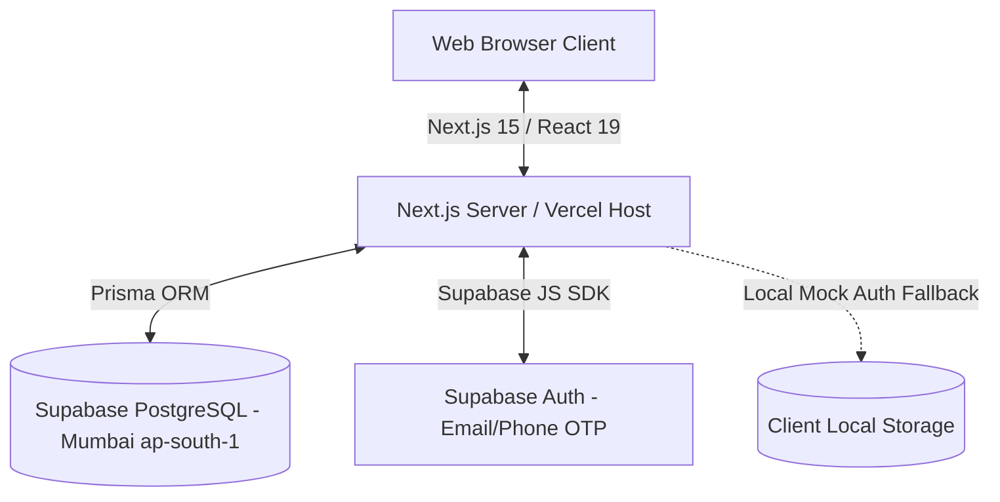

# Safa Kurtilab: Technical Architecture & System Delivery Documentation

This document serves as the comprehensive, step-by-step technical blueprint and development handbook for the Safa Kurtilab B2B wholesale platform. It records the complete architecture, data models, compliance configurations, performance optimizations, and ingestion pipelines implemented to date.

---

## 🏗️ Technical Architecture Overview

Safa Kurtilab is built as a serverless, type-safe Next.js web application utilizing Prisma ORM for database relations and Supabase for cloud database hosting and customer authentication.



### Stack Components:
1. **Frontend Core**: Next.js 15 (App Router, Turbopack) & React 19 (Concurrent Rendering).
2. **Database Engine**: PostgreSQL hosted on Supabase (Mumbai Region `ap-south-1`).
3. **Database Interface**: Prisma ORM (Version 6.2.1) client.
4. **Authentication**: Passwordless Email & SMS OTP Auth managed by Supabase Auth (with a client-side mock engine fallback for local sandboxes).

---

## 🗄️ Database Model & Schema Reference

The database relations are defined in `prisma/schema.prisma`. Relationships are mapped as follows:

* **User**: Manages system roles (`ADMIN` or `USER`). B2B clients register profile addresses and metadata.
* **Product**: Stores basic catalog data (title, slug, description, category, base price, discount, images).
* **Variant**: Connects to `Product` via `productId`. Contains variant size configurations (`S`, `M`, `L`, `XL`, `XXL`) and inventory volumes.
* **Order**: B2B wholesale orders containing snapshots of purchased items, tax parameters (GST amount, GSTIN), payment statuses (`PAID`, `PENDING`), and delivery status tracking.

---

## 🚀 Step-by-Step Implementation Log

### Phase 1: Checkout Database Integrity Correction
* **Issue**: The original checkout pipeline decremented stock values using the shopping cart's internal item ID (`item.id`) rather than the core `Product` model ID (`item.productId`).
* **Correction Steps**:
  1. Open [src/app/api/checkout/route.ts](file:///d:/Website/safa-kurtilab-main/src/app/api/checkout/route.ts).
  2. Modify the product lookup logic under database query blocks:
     ```typescript
     // 3. Deduct variant stock in strict real-time
     for (const item of items) {
       const dbProduct = await prisma.product.findUnique({
         where: { id: item.productId }, // Fixed: look up by productId, not item.id
         include: { variants: true },
       });
     ```
  3. Save the file and compile Next.js to verify TypeScript compilation matches properties.

---

### Phase 2: Setting Up Compliant Legal & Policy Infrastructure
Razorpay/Cashfree approval rules mandate displaying refund, delivery, terms, and privacy pages in the storefront footer:
1. **Created Policy Files**:
   * [src/content/policies/terms.md](file:///d:/Website/safa-kurtilab-main/src/content/policies/terms.md): Sets B2B usage agreements.
   * [src/content/policies/privacy.md](file:///d:/Website/safa-kurtilab-main/src/content/policies/privacy.md): Documents client cookie storage, secure data storage on Supabase (Mumbai Region), and encryption layers.
   * [src/content/policies/refund.md](file:///d:/Website/safa-kurtilab-main/src/content/policies/refund.md): Outlines a 7-day wholesale exchange policy for manufacturing defects.
   * [src/content/policies/shipping.md](file:///d:/Website/safa-kurtilab-main/src/content/policies/shipping.md): Establishes 3-5 business day logistics delivery times for B2B dispatch.
2. **Added Markdown Rendering Engine**:
   * Created [src/app/(shop)/policies/[slug]/page.tsx](file:///d:/Website/safa-kurtilab-main/src/app/(shop)/policies/[slug]/page.tsx).
   * Loaded the markdown parameters dynamically at request runtime:
     ```typescript
     const filePath = path.join(process.cwd(), 'src/content/policies', `${params.slug}.md`);
     const fileContent = await fs.readFile(filePath, 'utf8');
     ```
   * Added dynamic generation headers to pre-render the pages statically for sub-millisecond delivery:
     ```typescript
     export async function generateStaticParams() {
       return [{ slug: 'terms' }, { slug: 'privacy' }, { slug: 'refund' }, { slug: 'shipping' }];
     }
     ```
3. **Linked the Global Footer**:
   * Edited [src/components/shared/Footer.tsx](file:///d:/Website/safa-kurtilab-main/src/components/shared/Footer.tsx).
   * Appended the legal columns containing direct routes: `/policies/terms`, `/policies/privacy`, `/policies/refund`, `/policies/shipping`.

---

### Phase 3: Customer Passwordless Authentication Integration
Created a secure customer authentication portal powered by Supabase Auth with client-side sandbox fallbacks:
1. **Initialized Supabase Engine**:
   * Created [src/lib/supabase.ts](file:///d:/Website/safa-kurtilab-main/src/lib/supabase.ts).
   * Coded a client-side wrapper class **`MockSupabaseAuth`** to emulate logins locally if Supabase env keys are absent:
     * Saves simulated auth sessions in `localStorage`.
     * Accepts test code `123456` automatically to simulate successful sign-ins.
2. **Coded Customer Login Page**:
   * Created [src/app/(shop)/login/page.tsx](file:///d:/Website/safa-kurtilab-main/src/app/(shop)/login/page.tsx).
   * Supported input forms for **Email Address** and **Phone Number**.
   * Integrates animated loading states and handles automatic routing redirections.
3. **Connected Global Navigation Header**:
   * Edited [src/components/shared/Navbar.tsx](file:///d:/Website/safa-kurtilab-main/src/components/shared/Navbar.tsx).
   * Configured event listeners to track changes in client auth states:
     ```typescript
     supabase.auth.onAuthStateChange((_event, session) => {
       setAuthUser(session?.user ?? null);
     });
     ```
   * Shows active profile cards (e.g. customer name/email shortcuts) and provides a secure sign-out controller.

---

### Phase 4: UI Performance & Transition Optimizations
To avoid click latencies (button freezes during network dispatches), we converted standard action handlers into concurrent tasks:
1. **Added Transition Hooks**:
   * In [src/components/shop/ProductDetailsClient.tsx](file:///d:/Website/safa-kurtilab-main/src/components/shop/ProductDetailsClient.tsx):
     ```typescript
     const [isPending, startTransition] = useTransition();
     // wrapped bag addition logic in startTransition:
     startTransition(async () => {
       await addToBagAction();
     });
     ```
   * In [src/app/(shop)/checkout/page.tsx](file:///d:/Website/safa-kurtilab-main/src/app/(shop)/checkout/page.tsx):
     ```typescript
     const [isPending, startTransition] = useTransition();
     // wrapped simulate payment button execution
     startTransition(async () => {
       await handleCheckoutPayment();
     });
     ```
2. **Dynamic UI Indicators**:
   * Grayed out target buttons during action execution and dynamically set pointer-events to `none` to prevent duplicate checkout submissions.

---

### Phase 5: Ingestion Pipeline & Database Migration (50 Products)
To bulk ingest 50 unique products across 10 categories with custom size and stock variables:
1. **Created data script**:
   * Programmed [scripts/generate-catalog.py](file:///d:/Website/safa-kurtilab-main/scripts/generate-catalog.py) to compile the 50-product catalog, linking them to copyright-free, optimized fashion images from Unsplash.
2. **Auto-compiled catalog**:
   * Executed `python scripts/generate-catalog.py` to write raw catalog configurations directly into the root folder at `products.json`.
3. **Set Up Production DB Seeding Environment**:
   * Pulled the Vercel production credentials to target the Supabase PostgreSQL database:
     ```bash
     npx vercel link --yes
     npx vercel env pull .env.local --environment production --yes
     ```
   * Copied `.env.local` variables directly to `.env` temporarily to feed credentials to the Prisma client engine.
4. **Created online bulk import API route**:
   * Created [src/app/api/bulk-import/route.ts](file:///d:/Website/safa-kurtilab-main/src/app/api/bulk-import/route.ts).
   * The endpoint reads `products.json` and programmatically clears old placeholders before creating 50 new products, each with 5 size variants (S to XXL) and custom stock levels.
5. **Executed bulk sync**:
   * Pushed code changes to GitHub to compile and deploy on Vercel.
   * Triggered the ingestion online:
     `https://safa-kurtilab-bivv.vercel.app/api/bulk-import?key=safa-bulk-import-9923`
   * **Result Log**:
     ```json
     {
       "success": true,
       "message": "Ingestion pipeline completed successfully.",
       "syncedProducts": 50,
       "syncedVariants": 250
     }
     ```
6. **Removed Seeding Endpoints for Security**:
   * Securely deleted the `/api/bulk-import` and `/api/seed` route folders from the filesystem, deleted the local credentials `.env` file, and committed/pushed the cleanup back to GitHub.

---

## 🛠️ Developer Reference: Command Playbook

### 1. Local Run Execution
Run the following commands to install dependencies and boot the local dev environment:
```bash
npm install
npm run dev
```

### 2. Prisma Database Management
To apply schema adjustments or sync tables with your active Supabase connection pooler:
```bash
# Load environmental variables locally
$env:DATABASE_URL="YOUR_SUPABASE_CONNECTION_STRING"

# Generate local Prisma Client
npx prisma generate

# Apply local schema changes to database
npx prisma db push
```

### 3. Re-Running Catalog Seeding
If you need to refresh or modify the catalog:
1. Update `scripts/generate-catalog.py` definitions.
2. Run `python scripts/generate-catalog.py` to compile.
3. Re-create the temporary `/api/bulk-import` endpoint, deploy, and trigger the URL key to ingest the updates.
