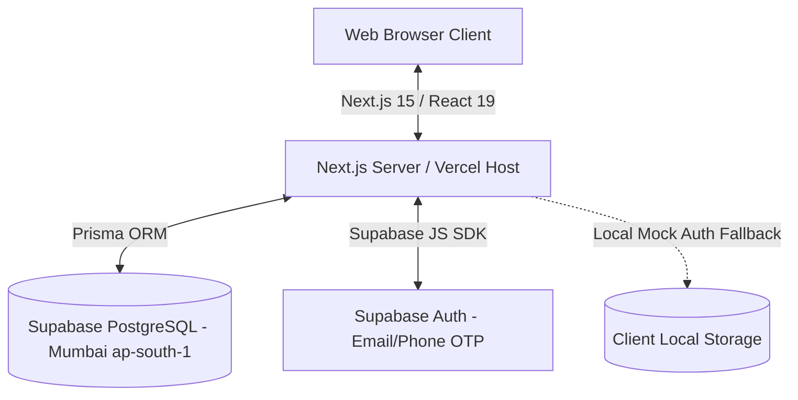

# Safa Kurtilab: Technical Architecture & System Delivery Documentation

This document serves as the technical blueprint and development handbook for the Safa Kurtilab B2B wholesale platform. It records the complete architecture, data models, compliance configurations, performance optimizations, and ingestion pipelines implemented to date.

---

## 🏗️ Technical Architecture Overview

Safa Kurtilab is built as a serverless, type-safe Next.js web application utilizing Prisma ORM for database relations and Supabase for cloud database hosting and customer authentication.



### Stack Components:
1. **Frontend Core**: Next.js 15 (App Router, Turbopack) & React 19 (Concurrent Rendering).
2. **Database Engine**: PostgreSQL hosted on Supabase (Mumbai Region `ap-south-1`).
3. **Database Interface**: Prisma ORM (Version 6.2.1) client.
4. **Authentication**: Passwordless Email & SMS OTP Auth managed by Supabase Auth (with a client-side mock engine fallback for local sandboxes).

---

## 🗄️ Database Model & Schema Reference

The database relations are defined in `prisma/schema.prisma`. Relationships are mapped as follows:

* **User**: Manages system roles (`ADMIN` or `USER`). B2B clients register profile addresses and metadata.
* **Product**: Stores basic catalog data (title, slug, description, category, base price, discount, images).
* **Variant**: Connects to `Product` via `productId`. Contains variant size configurations (`S`, `M`, `L`, `XL`, `XXL`) and inventory volumes.
* **Order**: B2B wholesale orders containing snapshots of purchased items, tax parameters (GST amount, GSTIN), payment statuses (`PAID`, `PENDING`), and delivery status tracking.

---

## 📥 Ingestion Pipeline (50-Product Catalog)

To support automated catalog seeding, we implemented a three-stage ingestion pipeline:

```
[scripts/generate-catalog.py] ---> [products.json] ---> [/api/bulk-import (Vercel)] ---> [Supabase DB]
```

### Stage 1: The Python Catalog Compiler (`scripts/generate-catalog.py`)
Generates 50 distinct products across 10 categories mapping to optimized fashion images on Unsplash.
* **10 Categories**: *Anarkali, Straight Fit, A-Line, Angrakha, Asymmetric, Jacket Style, Flared & Phiran, Indo-Western, Kaftan Style, Boutique Special.*
* Outputs clean data directly to `products.json` in the root folder.

### Stage 2: Database Ingestion Interface
The pipeline can be triggered online or locally:
1. **Online Route (`/api/bulk-import`)**: A temporary secure Next.js API route that reads `products.json`, deletes old records, and populates the production Supabase database. This runs in Vercel's context where `DATABASE_URL` environment variables are pre-configured.
2. **Ingestion Loop**:
   * Generates safe, URL-friendly unique slugs for each product.
   * Auto-creates size variants (`S`, `M`, `L`, `XL`, `XXL`) and hooks them to the correct product ID.
   * Populates default color tags and inventory counts.

---

## 🔑 Customer OTP Authentication Architecture

To enable passwordless client signups and log in, the authentication framework is built around:

### 1. Unified Client Config (`src/lib/supabase.ts`)
* Automatically checks for `NEXT_PUBLIC_SUPABASE_URL` and `NEXT_PUBLIC_SUPABASE_ANON_KEY`.
* If keys are missing (such as in local development), it automatically swaps the export with **`MockSupabaseAuth`**, a browser-based simulator. This lets team developers test signups, sign-ins, and checkout validations offline without environment keys.

### 2. Passwordless Flow (`src/app/(shop)/login/page.tsx`)
* Customers choose **Email** or **Phone Number**.
* Fires `signInWithOtp` via the client.
* Once the OTP code is submitted, validates it via `verifyOtp` and triggers a redirect back to the shopping bag.

---

## 📄 Legal Compliance Architecture (Payment Gateways)

Payment processors like Razorpay and Cashfree require mandatory customer protection policies inside the storefront footer. We structured this compliance system cleanly:

### 1. Policy Content Files (`src/content/policies/`)
* **`terms.md`**: Legal terms of service.
* **`privacy.md`**: Privacy rights, data collection, and hosting details.
* **`refund.md`**: 7-day B2B wholesale cancellation and refund regulations.
* **`shipping.md`**: Shipping durations and delivery timelines.

### 2. Dynamic Rendering Route (`src/app/(shop)/policies/[slug]/page.tsx`)
* Compiles Markdown text dynamically at build-time using `fs` and renders standard styled HTML.

### 3. Global Footer Linkage (`src/components/shared/Footer.tsx`)
* Integrates all policy URLs in the site footer navigation layout.

---

## ⚡ UI Performance & Real-Time Security Optimizations

### 1. Concurrent Transitions (`useTransition`)
To eliminate lag, interactive actions are wrapped in React 19 `useTransition` blocks:
* **Add to Bag (`ProductDetailsClient.tsx`)**
* **Checkout Pay Form (`checkout/page.tsx`)**
* **Result**: Action functions run asynchronously in the background. The browser remains responsive and interactive.

### 2. Real-Time Stock Integrity Check (`api/checkout/route.ts`)
Deducts stock volumes during checkout processes safely by mapping product inventory lookups by `item.productId` rather than the shopping cart row item ID.

---

## 🛠️ Future Development & Local Run Guidelines

### Running Local Development
1. Run local dependencies:
   ```bash
   npm install
   ```
2. Pull database schemas (if you have the connection string set in a local `.env`):
   ```bash
   npx prisma db pull
   npx prisma generate
   ```
3. Boot the local Next.js environment:
   ```bash
   npm run dev
   ```

### Regenerating Catalog Data
If you need to regenerate or add products:
1. Edit `scripts/generate-catalog.py` to change category lists or name templates.
2. Run:
   ```bash
   python scripts/generate-catalog.py
   ```
3. Push to GitHub to let Vercel trigger builds.
