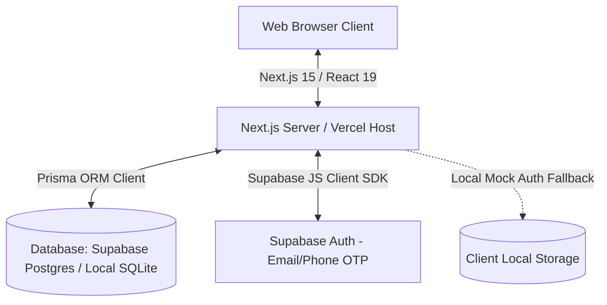

# Safa Kurtilab: The Definitive Technical Architecture & Codebase Handbook

This document serves as the absolute, single source of truth for the Safa Kurtilab storefront, B2B billing engine, and inventory command center. It provides an exhaustive, file-by-file specification of the database architecture, code structures, exact logic flows, variable interfaces, algorithms, and developer execution playbooks.

---

## 🏗️ 1. Technical Architecture & System Integration

Safa Kurtilab is built as a serverless, type-safe Next.js 15.5 web application utilizing Prisma ORM for database connectivity and a highly optimized client-side state machine.



### Core System Stack:
1. **Frontend Core**: Next.js 15.5 App Router (running React 19 concurrent features). Built with Tailwind CSS 4 using custom HSL/HEX variables.
2. **Database Engine**: PostgreSQL hosted on Supabase (Mumbai Region `ap-south-1`) for production serverless deployments.
3. **Database Client**: Prisma ORM Client (v6.2.1) configured with connection pooling (`pgbouncer=true`).
4. **State Machine**: Zustand (v5.0) featuring LocalStorage state persistence.
5. **Logistics Engine**: Custom integration model simulating India-wide 3PL (Shiprocket/Delhivery) dispatch allocations.

---

## 📁 2. Complete Project Directory Layout

```
d:\Website\
├── .env                                # Local environment parameters (database URLs, Razorpay mock keys)
├── .gitignore                          # Excludes node_modules, build outputs, local sqlite databases
├── ARCHITECTURE.md                     # [This File] Complete reference map for development
├── eslint.config.mjs                   # ESLint configuration, ignores utility scripts
├── next.config.ts                      # Next.js configuration, defines image assets remote domain white-lists
├── package.json                        # Node package manifest, locks frameworks, scripts and dependency versions
├── postcss.config.mjs                  # Tailwinds CSS post-processing engine compiler rules
├── products.json                       # Catalog config containing metadata for 50 luxury items
├── tsconfig.json                       # TypeScript project rules and compiler target parameters
│
├── prisma/
│   ├── dev.db                          # Local SQLite binary database
│   ├── schema.prisma                   # Database blueprint containing models and provider configs
│   └── seed.js                         # Database seeder, registers default users, 50 products and history logs
│
├── scripts/
│   ├── bulk-import.ts                  # Local node pipeline to import products.json items
│   ├── csv-import.ts                   # Ingest products.csv draft items and auto-create variants (Prisma)
│   ├── generate-catalog.py             # Python script generating 50 products using Unsplash resources
│   ├── get-links.py                    # Generates pre-encoded B2B WhatsApp API redirect links
│   ├── indiamart-check.py              # Playwright Chrome session supplier crawler
│   ├── test-live-order.js              # Inter-state webhook transaction tester
│   ├── urls.txt                        # UTF-8 text file storing generated WhatsApp links
│   ├── upload-images.js                # Cloudinary image uploader script
│   ├── whatsapp-outreach.py            # Whatsapp PyWhatKit automation sequence for wholesale updates
│   └── whatsapp_parser.py              # Parses raw WhatsApp text copy and images into products.csv
│
├── public/
│   └── images/                         # Static image assets for the storefront curation
│
└── src/
    ├── app/
    │   ├── globals.css                 # Global styling classes (emerald/gold colors, glass styling)
    │   ├── layout.tsx                  # Global fonts loader (Playfair Display + Plus Jakarta Sans)
    │   │
    │   ├── (dashboard)/
    │   │   ├── layout.tsx              # Grid container wrapper for internal admin screens
    │   │   └── admin/
    │   │       └── page.tsx            # Server Component fetching metrics logs, clients and products list
    │   │
    │   ├── (shop)/
    │   │   ├── layout.tsx              # Storefront wrapper incorporating Navbar and Footer components
    │   │   ├── page.tsx                # Homepage featuring collections, categories and trending items
    │   │   ├── checkout/
    │   │   │   └── page.tsx            # Checkout page, validates B2B GSTIN, handles payments
    │   │   ├── login/
    │   │   │   └── page.tsx            # Login panel, requests and verifies OTP credentials
    │   │   ├── policies/
    │   │   │   └── [slug]/
    │   │   │       └── page.tsx        # Legal markdown rendering page (pre-rendered statically)
    │   │   └── products/
    │   │       ├── page.tsx            # Product catalog index filtering category/size/color/discounts
    │   │       └── [slug]/
    │   │           └── page.tsx        # Dynamic product detail page setting tags and loading clients
    │   │
    │   └── api/
    │       ├── checkout/
    │       │   └── route.ts            # Places orders and deducts size variant inventory stock in real-time
    │       ├── products/
    │       │   ├── route.ts            # API endpoint to fetch products based on category filters
    │       │   └── bulk/
    │       │       └── route.ts        # Ingests new B2B products from products.csv and generates variants
    │       └── webhooks/
    │           └── payment/
    │               └── route.ts        # Payment webhook logic (state-wise GST split, Shiprocket 3PL dispatch)
    │
    ├── components/
    │   ├── admin/
    │   │   └── AdminDashboardClient.tsx # Charts and widgets displaying sales metrics and stock warnings
    │   ├── shared/
    │   │   ├── Footer.tsx              # Global footer listing policy routes and studio information
    │   │   └── Navbar.tsx              # Header layout handling cart count checks and auth sessions
    │   └── shop/
    │       ├── CartDrawer.tsx          # Sliding checkout drawer tracking cart subtotals and discounts
    │       ├── FilterSidebar.tsx       # Sidebar checkboxes setting query filters on products catalog
    │       ├── ProductDetailsClient.tsx # Product details viewer handling size/color selections
    │       └── SortDropdown.tsx        # Catalog sorting dropdown
    │
    ├── content/
    │   └── policies/                   # Privacy, refund, terms, and shipping policy files in markdown
    │
    ├── hooks/
    │   └── useCart.ts                  # Zustand cart store with localStorage persistence and hydration guards
    │
    └── lib/
        ├── prisma.ts                   # Prisma client singleton class
        ├── shiprocket.ts               # 3PL logistics simulator assigning couriers and manifest links
        └── supabase.ts                 # Supabase client wrapper with integrated Mock Auth bypass engine
```

---

## 🗄️ 3. Database Architecture & Prisma Models

The database models are configured in [prisma/schema.prisma](file:///d:/Website/prisma/schema.prisma) and map to PostgreSQL tables:

### 3.1. `User` Model
Represents both B2B corporate wholesale buyers and guest retail clients.
* **Fields**:
  * `id`: `String` (Primary Key, defaults to `cuid()`)
  * `name`: `String?` (Nullable user name)
  * `email`: `String` (Unique constraint)
  * `password`: `String?` (Used for credential fallback)
  * `role`: `String` (Defaults to `'USER'`. Options: `'ADMIN'`, `'USER'`)
  * `createdAt`: `DateTime` (Defaults to `now()`)
* **Relations**: Maps a one-to-many relationship with the `Order` model.

### 3.2. `Product` Model
Represents the core catalog apparel silhouette details.
* **Fields**:
  * `id`: `String` (Primary Key, defaults to `cuid()`)
  * `title`: `String` (Apparel title, e.g. "Emerald Royale Silk Kurta")
  * `slug`: `String` (Unique constraint, URL slug)
  * `description`: `String` (Rich HTML text details)
  * `basePrice`: `Float` (Standard wholesale base price before tax)
  * `discount`: `Float` (Percentage discount integer, defaults to `0`)
  * `images`: `String` (Comma-separated string of image file paths or Cloudinary/Unsplash secure URLs)
  * `category`: `String` (Silhouette categories: e.g. "Anarkali", "Straight Cut", "A-Line")
  * `createdAt`: `DateTime` (Defaults to `now()`)
* **Relations**: Connects to `Variant` as a one-to-many relationship mapping (`variants`).

### 3.3. `Variant` Model
Tracks stock inventory records mapped specifically to colors and sizing codes.
* **Fields**:
  * `id`: `String` (Primary Key, defaults to `cuid()`)
  * `productId`: `String` (Foreign key pointing to `Product.id`)
  * `size`: `String` (Available options: `XS`, `S`, `M`, `L`, `XL`, `XXL`)
  * `color`: `String` (Color swatch codes: e.g. "Emerald", "Mustard Gold", "Crimson Velvet")
  * `stock`: `Int` (Real-time stock value count)
* **Relations**: Belongs to `Product` via `productId` (cascade delete rule applied).

### 3.4. `Order` Model
Represents financial transactions, invoicing details, corporate B2B details, and logistics status tracking.
* **Fields**:
  * `id`: `String` (Primary Key, defaults to `cuid()`)
  * `userId`: `String` (Foreign key pointing to `User.id`)
  * `items`: `String` (JSON stringified snapshot array storing `id`, `title`, `price`, `quantity`, `size`, `color`)
  * `totalAmount`: `Float` (Net price subtotal after discounts, before tax)
  * `gstAmount`: `Float` (Tax amount value, computed as 5% of subtotal)
  * `gstin`: `String?` (Nullable B2B client GSTIN code, validated by `GSTIN_REGEX`)
  * `companyName`: `String?` (Nullable B2B client registered company name)
  * `paymentStatus`: `String` (Options: `'PENDING'`, `'PAID'`, `'FAILED'`)
  * `deliveryStatus`: `String` (Options: `'PROCESSING'`, `'SHIPPED'`, `'DELIVERED'`)
  * `trackingId`: `String?` (Assigned logistics tracking reference)
  * `invoiceData`: `String?` (Rich JSON string detailing tax computations, manifest URLs, and estimated delivery dates)
  * `phone` / `address` / `city` / `state` / `pincode`: `String?` (Shipping credentials)
  * `createdAt`: `DateTime` (Defaults to `now()`)
* **Relations**: Belongs to `User` via `userId`.

---

## ⚙️ 4. Exhaustive File-by-File Logic & Code Specifications

### 4.1. Checkout Processing API (`src/app/api/checkout/route.ts`)
Processes initial cart creation requests and logs orders.
```
Incoming Request (JSON Payload)
   │
   ├── Validate Payload (items, totalAmount, email, state)
   │     └── Fail -> return 400 Bad Request
   │
   ├── Query User by Email
   │     ├── Found -> Select user reference
   │     └── Not Found -> Create Guest User (role: 'USER')
   │
   ├── Create Order Row (Prisma Transaction)
   │     └── Sets paymentStatus: 'PAID' (Simulated Default)
   │
   └── Loop through cart items:
         ├── Query Product by unique 'item.productId'
         ├── Find matching Variant (matching size & color)
         └── Decrement Stock: stock = Math.max(0, variant.stock - item.quantity)
```
* **Variables**:
  * `body`: Parsed request JSON container.
  * `dbProduct`: Holds unique product query returns (`include: { variants: true }`).
  * `matchingVariant`: Filters variants matching `${item.size}` and `${item.color}`.
  * `newStock`: Prevents negative values via `Math.max(0, ...)`.

---

### 4.2. Payment Webhook & India GST Automation (`src/app/api/webhooks/payment/route.ts`)
Executes state-wise GST split computations, assigns garment HSN codes, and schedules 3PL pickup.
* **Intra-State Split Rule (West Bengal Origin)**:
  * Origin state is West Bengal.
  * State parameters are sanitized: `normalizedState = (order.state || '').trim().toLowerCase()`.
  * Matches `west bengal`, `wb`, or `w.b.`.
  * If true, tax amount splits into:
    * `cgst = baseAmount * 0.025` (2.5% CGST)
    * `sgst = baseAmount * 0.025` (2.5% SGST)
  * If false, tax routes entirely to IGST:
    * `igst = baseAmount * 0.05` (5% IGST)
* **HSN Ingestion**:
  * Loops over order lines and appends `"hsnCode": "6208"` (under Chapter 62 of Custom Tariff Act for Kurtis and garments).
* **3PL Courier Integration**:
  * Calls `bookShiprocketPickup(order.id, customerDetails, itemsWithHSN)` from [src/lib/shiprocket.ts](file:///d:/Website/src/lib/shiprocket.ts).
  * Updates the order status with:
    * `paymentStatus: 'PAID'`
    * `deliveryStatus: 'SHIPPED'`
    * `trackingId: shippingResponse.trackingId`
    * `invoiceData`: JSON string storing values for `courier`, `labelUrl`, `manifestUrl`, and `estimatedDelivery`.

---

### 4.3. Client Cart Operations (`src/hooks/useCart.ts`)
Manages Zustand memory state with browser persistent storage syncing.
* **CartItem Structure**:
  ```typescript
  export interface CartItem {
    id: string;        // Generated unique composite key: `${productId}-${size}-${color}`
    productId: string; // References Product.id
    title: string;
    price: number;     // Original base price
    discount: number;  // Percentage discount
    image: string;     // Thumbnail string path
    size: string;
    color: string;
    quantity: number;
  }
  ```
* **Operations**:
  * `addItem`: Generates composite ID. If the item exists in the array, it increments `quantity` by 1. Otherwise, it pushes the new item with `quantity: 1`.
  * `removeItem`: Filters out items matching the target composite `id`.
  * `updateQuantity`: Updates the quantity parameter of the matched item, or removes the item if quantity falls to `0`.
  * `getCartTotal`: Sums item prices after discounts are applied:
    * `discountAmt = item.price * (item.discount / 100)`
    * `finalItemPrice = item.price - discountAmt`
    * `total = total + finalItemPrice * item.quantity`
  * `getGSTAmount`: Computes tax as exactly `getCartTotal() * 0.05`.
  * `getGrandTotal`: Returns `getCartTotal() + getGSTAmount()`.
* **Hydration Safety**:
  * Standard server rendering engines mismatch React nodes if browser state differs from server returns. To avoid hydration errors, the exported wrapper hook `useCart()` initializes state values (`items`, `cartTotal`, `grandTotal`) only after `useEffect` flips `isHydrated` to `true`.

---

### 4.4. Supabase Client & Mock Auth Bypass (`src/lib/supabase.ts`)
Acts as a proxy bridge, checking for environment keys and executing mock local authentication sequences when necessary.
* **Mock Auth Logic**:
  * Detects missing keys or placeholders:
    `const isMock = !supabaseUrl || !supabaseAnonKey || supabaseUrl.includes('mock.supabase.co');`
  * If `isMock` evaluates to true, exports a proxy client redirecting auth methods to the custom class `MockSupabaseAuth`.
* **Verification Bypass (Token: `123456`)**:
  * `signInWithOtp` logs values and simulates a 600ms latency request delay, resolving successfully.
  * `verifyOtp` evaluates parameters. If `token` matches `'123456'` (or is any 6-digit length sequence during local sandbox testing), it creates a simulated customer JWT token payload and commits it to `localStorage` under the key `'safa-kurtilab-mock-session'`.

---

### 4.5. Customer Login Controller (`src/app/(shop)/login/page.tsx`)
Responsive client viewport managing logins.
* **States**:
  * `authMethod`: Toggle values (`'email'` or `'phone'`).
  * `inputVal`: Tracks input email string or mobile digits.
  * `otpStep`: Tracks progress steps (`'request'` to input address, `'verify'` to input verification OTP).
  * `otpCode`: Monitored 6-digit verification code string.
* **Auth Submissions**:
  * Wrapped inside React 19's `useTransition` hook:
    ```typescript
    const [isPending, startTransition] = useTransition();
    ```
  * Disables input fields and buttons during transition phases to prevent double submissions. Upon OTP verification success, redirects the user to the storefront homepage after a 1.5-second status alert.

---

### 4.6. Checkout & GSTIN Validation (`src/app/(shop)/checkout/page.tsx`)
Main storefront billing form that parses addresses and validates corporate details.
* **GSTIN Validation Regex**:
  * Rules conform to the official Central Board of Indirect Taxes & Customs (CBIC) format:
    ```typescript
    const GSTIN_REGEX = /^\d{2}[A-Z]{5}\d{4}[A-Z]{1}[A-Z\d]{1}[Z]{1}[A-Z\d]{1}$/;
    ```
    * `\d{2}`: State code digits (e.g. `07` for Delhi, `19` for West Bengal).
    * `[A-Z]{5}\d{4}[A-Z]{1}`: PAN card format (5 letters, 4 digits, 1 letter).
    * `[A-Z\d]{1}`: Entity code.
    * `[Z]{1}`: Default character 'Z'.
    * `[A-Z\d]{1}`: Checksum digit.
* **Validation Handler**:
  * If B2B is toggled (`isB2B = true`), checking `isFormValid()` evaluates base fields, `companyName`, and verifies that `GSTIN_REGEX.test(gstin.toUpperCase())` is successful. If false, disables the checkout submit button.
* **Checkout Transition**:
  * simulated payment processing is wrapped in `startTransition()`, managing loaders and preventing duplicate order creation dispatches.

---

### 4.7. Product Details Interface (`src/components/shop/ProductDetailsClient.tsx`)
Provides size and color selections, checks stock volumes, and links to the cart drawer.
* **Stock Alert Calculations**:
  * Finds the matching variant for the chosen size and color:
    ```typescript
    const currentVariant = product.variants.find(
      (v) => v.size === selectedSize && v.color === selectedColor
    );
    ```
  * stock calculations:
    * `variantStock`: Returns `currentVariant.stock` or `0`.
    * `isOutOfStock`: Evaluates true if `variantStock === 0`.
    * `isLowStock`: Evaluates true if `variantStock > 0 && variantStock < 5`. Displays warnings (`Only X pieces left. Secure yours now!`).
* **Cart Interactions**:
  * Uses `startTransition` to execute cart operations. Upon completion, triggers a click event on the Navbar's cart element to slide open the cart drawer.

---

### 4.8. Admin Command Widgets (`src/components/admin/AdminDashboardClient.tsx`)
Provides administrative charts, alerts, and inventory tables.
* **Sales Velocity Area Chart**:
  * Uses `recharts` responsive container elements (`AreaChart`, `Area`, `XAxis`, `YAxis`, `CartesianGrid`, `Tooltip`).
  * Maps orders history data grouped by date:
    ```typescript
    const salesMap = new Map<string, number>();
    orders.forEach((order) => {
      const dateStr = new Date(order.createdAt).toLocaleDateString('en-IN', {
        day: 'numeric',
        month: 'short',
      });
      salesMap.set(dateStr, (salesMap.get(dateStr) || 0) + order.totalAmount);
    });
    ```
* **Metrics Cards**:
  * Gross Sales: `orders.reduce((sum, o) => sum + o.totalAmount, 0)`.
  * Total Orders Count: `orders.length`.
  * Low Stock Warnings: Filters variants with stock counts under 5 units.

---

### 4.9. Policies Page Layout (`src/app/(shop)/policies/[slug]/page.tsx`)
Loads and compiles policy files.
* **File Ingestion**:
  * Matches route parameters (`params.slug`) against policy markdown files in `src/content/policies/`.
  * Reads file parameters asynchronously:
    ```typescript
    const filePath = path.join(process.cwd(), 'src/content/policies', `${params.slug}.md`);
    const fileContent = await fs.readFile(filePath, 'utf8');
    ```
  * Parses markdown parameters into raw HTML structure using `marked`.
* **Static Generation**:
  * Pre-renders legal documents at build-time using `generateStaticParams()`:
    ```typescript
    export async function generateStaticParams() {
      return [{ slug: 'terms' }, { slug: 'privacy' }, { slug: 'refund' }, { slug: 'shipping' }];
    }
    ```

### 4.10. Autopilot Social Scheduler Agent (`scripts/social-scheduler.py`)
Dispatches new inventory catalog updates automatically to Meta Facebook Page feeds and Instagram Business Profile feeds.
* **Mechanics**:
  1. Manually parses the root `.env` file to extract credentials (`META_ACCESS_TOKEN`, `META_PAGE_ID`, `META_IG_BUSINESS_ID`), allowing a zero-dependency execution footprint without `python-dotenv`.
  2. Queries the first product entry in the local `products.json` file.
  3. **Lightweight AI Captions Generator**: Rotating templates draft descriptive luxury text with automated category hashtags based on name properties.
  4. **Direct Meta Graph API Postings**:
     * **Facebook**: Fires `POST` calls to `https://graph.facebook.com/v18.0/{page_id}/photos` sending image links and description parameters.
     * **Instagram**: Runs a two-step pipeline. Creates a media container target via `/media` first, and publishes it via `/media_publish` using the creation container ID reference.
  5. **Offline Sandbox Fallback**: If requests module is not found or mock keys are parsed, prints details to the terminal console using box-drawn ASCII grids.

---

### 4.11. 3PL Logistics Status Webhook & Reverse Inventory Sync (`src/app/api/orders/webhook/route.ts`)
Automates order state transitions, triggers return inventory synchronizations, and dispatches customer notifications.
* **Mechanics**:
  1. Receives tracking update JSON payload containing `orderId` and `status` from courier networks (Delhivery/Shiprocket).
  2. Map logistics status values to database states:
     * `shipped` or `in_transit` -> Set `deliveryStatus = 'SHIPPED'`
     * `delivered` -> Set `deliveryStatus = 'DELIVERED'`, `paymentStatus = 'PAID'`
     * `returned` or `rto` -> Set `deliveryStatus = 'RETURNED'`, trigger stock restore.
     * `cancelled` or `canceled` -> Set `deliveryStatus = 'CANCELLED'`, trigger stock restore.
  3. **Inventory Reverse Synchronization**: If marked as returned or cancelled, queries the database items list, loops through orders inside a database transaction (`prisma.$transaction`), and increments variant stock counts by the ordered amount: `newStock = matchingVariant.stock + item.quantity`.
  4. **Resend Email Notification Dispatch**: Sends dynamic HTML update emails asynchronously to the customer's mailbox using Resend REST APIs (`https://api.resend.com/emails`).

---

### 4.12. B2B Wholesale Minimum Order Quantity (MOQ) Gate-Lock
Restricts checkout flows unless wholesale parameters are met to enforce a strict B2B model.
* **MOQ Rule Set**:
  - Cart must contain at least **5 distinct product variants/items** OR hit a subtotal threshold of **₹5,000**.
* **Frontend Enforcement**:
  - **Cart Drawer (`src/components/shop/CartDrawer.tsx`)**: Disables the "Proceed to Checkout" button dynamically and displays a styled warning notice if cart criteria are not met.
  - **Checkout Page (`src/app/(shop)/checkout/page.tsx`)**: Re-evaluates MOQ parameters. If bypassed via URL entry, locks the form submission and redirects or alerts the buyer about the wholesale requirement.

---

### 4.13. White-Label Shipping Label Generator & Category-Based RTO Routing
Generates Delhivery printable B2B shipping labels and handles automated category-based returns routing.
* **White-Label Origin**:
  - Automatically overwrites 'Sender/Origin' details on printable manifests with the permanent registered headquarters address: `Safa Kurtilab, Vill-Hareknagar Mollabari, P.O. Hareknagar, P.S. Beldanga, District: Murshidabad, West Bengal - 742133`.
  - Overwrites 'Pickup/Warehouse Location' dynamically using the manufacturer/wholesaler warehouse address mapped inside product metadata.
* **Category-Based Return to Origin (RTO)**:
  - If an order's status transitions to `RETURNED`, the system maps the return route directly back to the specific manufacturing plant address (e.g. Sanganer/Jaipur for cotton, Sachin GIDC/Surat for silk/synthetic) instead of Murshidabad, minimizing secondary logistics overhead.

---

### 4.14. IndiaMART Playwright Chrome Session Supplier Crawler (`scripts/indiamart-check.py`)
Queries verified supplier nodes securely utilizing logged-in local Google Chrome user profiles.
* **Mechanics**:
  1. Spawns Chromium using `launch_persistent_context` referencing the native Windows user profile path `~\AppData\Local\Google\Chrome\User Data`.
  2. Bypasses Cloudflare firewalls and bot detection rules using `--disable-blink-features=AutomationControlled` headers.
  3. Queries target listing search pages in headed mode, simulating real user behavior (idle timings).
  4. Scrapes and logs verified business parameters (`company_name`, `contact_node`) safely into console logs.
  5. Built using CP1252-safe ASCII markers (`[FETCH]`, `[OK]`, `[ERROR]`) to prevent terminal character map encoding crashes on Windows.

---

### 4.15. WhatsApp Parser & Bulk Database Ingestion Pipeline
Automates importing raw WhatsApp B2B text/image arrays into Prisma database tables.
* **Mechanics**:
  1. **Python Parser (`scripts/whatsapp_parser.py`)**:
     * Extracts base rates (e.g., `Rate 695+gst`), computes wholesale listing prices with 5% GST markup, parses fabrics/categories, and formats Cloudinary mockup URLs.
     * Appends rows to `src/data/products.csv` using a semicolon separated format for sizes (`S;M;L;XL;XXL`) and images to prevent CSV column splitting conflicts.
  2. **Bulk Ingestion API Route (`POST /api/products/bulk`)**:
     * Parses `src/data/products.csv` directly, ingests entries flagged with status `"Draft"`, automatically registers corresponding S-XXL size variants, and commits updates to Supabase inside transaction blocks.
     * Automatically overwrites the CSV status of ingested rows to `"Published"` on disk to prevent double ingestion.
  3. **Local CLI Importer (`scripts/csv-import.ts`)**:
     * Provides a console-based fallback using tsx to directly trigger transaction-safe database ingestion from `src/data/products.csv`.

---

## 🛠️ 5. Developer Action Playbook

Use these PowerShell routines inside the `d:\Website` workspace:

### 5.1. Booting Development Server
```bash
# Clean install modules
cmd /c npm install

# Launch developer host (http://localhost:3000)
cmd /c npm run dev
```

### 5.2. Running Linter & Production Build
```bash
# Execute ESLint validations
cmd /c npm run lint

# Compile production build
cmd /c npm run build
```

### 5.3. Setting Database Engine for Local Development (SQLite)
1. Verify [prisma/schema.prisma](file:///d:/Website/prisma/schema.prisma#L4-L7) database datasource block provider is set to `"sqlite"`.
2. Verify [.env](file:///d:/Website/.env#L5-L6) has `DATABASE_URL="file:./dev.db"` uncommented, and the PostgreSQL remote string commented out.
3. Run schema generation, migration, and seeder commands:
   ```bash
   # Recompile Prisma schema types
   cmd /c npx prisma generate

   # Synchronize schema structure with dev.db
   cmd /c npx prisma db push

   # Seed catalog products and accounts
   cmd /c node prisma/seed.js
   ```

### 5.4. Syncing Schema Changes with PostgreSQL (Supabase)
To apply schema adjustments to the remote PostgreSQL host:
1. Revert [schema.prisma](file:///d:/Website/prisma/schema.prisma) database provider block to:
   ```prisma
   datasource db {
     provider = "postgresql"
     url      = env("DATABASE_URL")
   }
   ```
2. Edit `.env` to comment out SQLite and uncomment the `postgresql://` connection pooler string.
3. Run:
   ```bash
   cmd /c npx prisma generate
   cmd /c npx prisma db push
   ```
